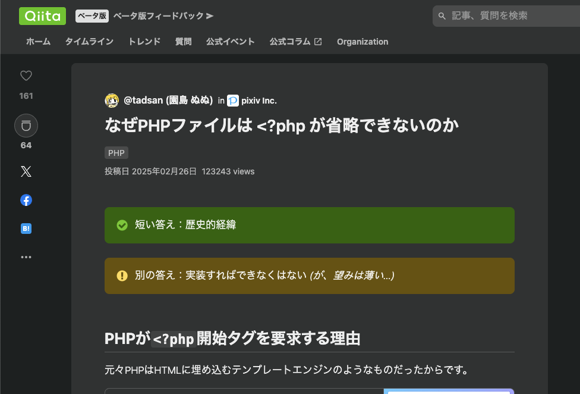

# Language Update PHP

## Learn Language 2025

---
<!-- {"freeze":"true","layout":"self-introduction"} -->

## お前誰よ

 * うさみけんた / にゃんだーすわん
   * GitHub: [@zonuexe](https://github.com/zonuexe)
 * 2012年11月から現職
 * ピクシブ株式会社 Platform Div PHPer
 * 2012年末から現職、APIとかCIとかいろいろなとこ
   * 最近はインフラっぽい仕事してます
 * Emacs PHP Modeを開発しています (2017年-)
 * プログラミング言語にちょっとこだわりのある素人 (spcamp2010)

---

# みなさんご存じですね？

---

# <?php

---

## どのくらいご存じかは人による

 * 2000年前後から世界中でWeb開発に活用されてきた
 * いわゆる動的型付けのスクリプト言語
 * とにかくいろいろな場面で使われてきた
   * Webアプリだけでなく汎用言語として多くのタスクをこなせる
 * 現代で有名なのは「WordPress」「Laravel」「Wikipedia」
   * PHPが嫌いでもPHPを避けて生活するのが難しいくらい

---
<!-- {"freeze":true} -->

## PHP以前 (1990年代)

 * Webアプリケーション ≒ CGI
   * 必ずしもそうではないが、ほとんどはそうだったはず
   * 例外：[普通のやつらの上を行け](https://practical-scheme.net/trans/beating-the-averages-j.html) Paul Graham: Common Lisp
 * CGIは任意の言語で書ける… ***が、***
   * Perl = パフォーマンスの問題
   * C言語 = メモリ安全に書くのが著しく難しい
   * ~~シェルスクリプト~~ = 非常に多くの課題がある

---

## PHPは何を解決したか (1990年代前半)

 * CGIではなくApacheのモジュールとして提供
   * 現実にはレンタルサーバの権限の問題でCGIモードで運用も多い
 * HTMLと統合されたテンプレート言語
   * コードとHTMLの親子関係が逆転する
 * ライブラリではなく言語レベルでHTTPをサポートしている
   * 他言語のCGIサポートはライブラリレベルなので、正しく使わないとヘッダインジェクションのリスクがあった

---
<!-- {"freeze":true} -->

## Webはどうなったか (2010年代)

 * ~~CGIではなくApacheのモジュールとして提供~~
   * CGIが廃れ、共用レンタルサーバの存在感が相対的に低下
 * HTMLと統合されたテンプレート言語
   * 各言語でテンプレートライブラリが普及、使うのが当たり前
 * ~~ライブラリではなく言語レベルでHTTPをサポートしている~~
   * CGIのような潜在的に危険なプロトコルが利用されなくなったので、フレームワークに乗って作る限り問題は起こらない

---

<!-- {"freeze":"true"} -->

# なぜ <?php が省略できないのか

---

## 他言語のWeb開発の断絶

 * CGIはリクエストごとにプロセスを起動し、HTTPを標準入出力と環境変数に置き換える
   * アーキテクチャなど考えず、シンプルな「スクリプト」でよかった
 * 2000年代にインターフェイス／サーバ／アプリケーション分離の風潮
   * Python: WSGI, Ruby: Rack, Perl: PSGI
 * PHPはトレンドに乗らず、CGI／レンタルサーバも健在であり続けた
   * Apacheのmod_perl, mod_rubyも存在するが、主流にはならず

---

## グレートリセットが起こらなかったPHP

 * Railsの普及により、Rubyでは事実上Railsに「標準化」された
   * Rack以前からあったRedmine, tDiaryなどはRackアプリケーションに移行
 * Python/Perlはフレームワークの寡占はないが、CGI世代と完全に断絶
 * PHPはLaravelが一般化しているが、フレームワークなしも混住
   * よくも悪くも2000年代始めの世界観を捨てきれていない
   * PHPにとっては「足枷」「便利ライブラリの集合」に過ぎない

---

# 21世紀のCGI

---

# 21世紀のSSI

---

# そんな言語でも進化は続く

---

## PHPの開発体制

 * Request for Comments <https://wiki.php.net/rfc>
   * 言語機能の改廃提案と投票プロセス、リリース周期が明文化
 * 機能提案する人は仕様をまとめてMLで議論、実装も責任を持って用意
 * PHP原作者のRasmus Lardorfは開発者としての1票しか行使しない
 * PHP 7.0(2015年)以降、11月末〜12月初頭にリリースが定着
   * 品質保障のためのfeature freeze、RC版なども定められた

---

## The PHP Foundation

 * PHPの著作権は「The PHP Group」という団体が持っている
 * 2021年にPHPの継続的な開発を支援する財団が設立された
 * PHPのメイン開発者だったNikita Popovの引退が契機
 * 各社からの協賛金を集め、数人のPHP「コア開発者」を雇っている
   * 日本からは高町咲衣さんが参加 (PHP 8.4 リリースマネージャ)

---

## PHPの言語仕様の進化

 * 最新版はPHP 8.4 (2024年11月リリース)
 * PHPユーザーの多様性
   * 開発文化 vs Web制作文化
 * 基本的にはかなり保守的だが、有用な機能はじわじわ追加されている
   * PHP 8.xで追加された構文を使えばかなり簡潔に書けることが多い
 * BC Breakは… そこそこある
   * 基本的には「なぜこんなコードが動くんだ」という変なケースが潰される

---

## PHPのOOP

<!-- {"freeze":true} -->

<!--  -->

---

## クラスの改善

 * readonlyプロパティ (PHP 8.1)
 * readonlyクラス (PHP 8.2)
 * プロパティフック (PHP 8.4)
   * C#のプロパティと同じようにプロパティの読み込みと書き込みに処理を書ける
 * 非対称プロパティ (PHP 8.4)

---

## #[Attribute] (PHP 8.0)

 * PHPは歴史的にDoc commentにメタデータを書く文化が発達していた
   * リフレクションAPIで文字列を取得できる
   * 構造化データは独自に構文解析する必要がある
 * #[Attribute] はPHPのシンタックスの一部としてパースされる
 * 誰もが使うというよりはフレームワークなどの機能として活用できる

---

## match式 (PHP 8.0)

 * 式バージョンのswitch
   * 従来のswitch文の使いにくさが改善されている
 * 残念ながら、高機能なパターンマッチ機能は未実装

---

## PHPのライセンス変更 (PHP 9.0?)

 * [PHP RFC: PHP License Update](https://wiki.php.net/rfc/php_license_update)
 * 本日時点ではまだ未確定だが、独自の **PHP License** からBSDライセンスに移行する提案
 * さまざまな歴史的経緯がまとめられていて読みごたえがある

